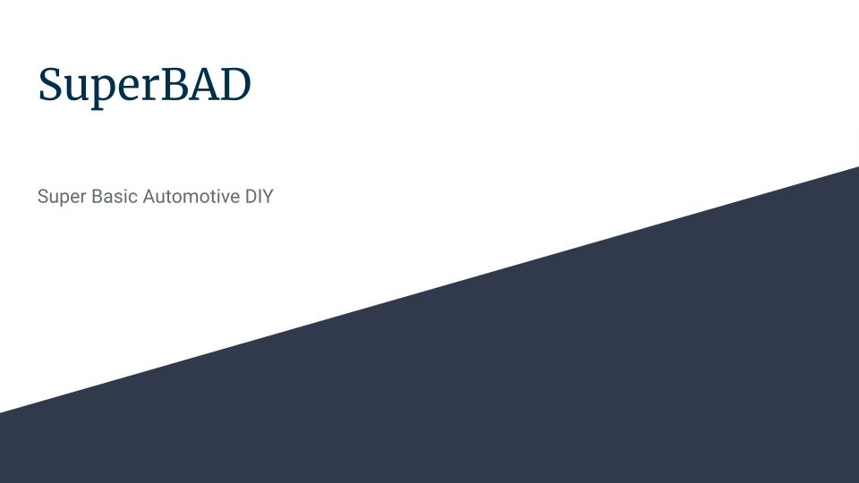

# Super-4-Project

<!-- PROJECT LOGO -->
 

  <a href="https://github.com/othneildrew/Best-README-Template">
    <!--  -->
  </a>

  <h3 align="center">SuperBad Automotive DIY</h3>

  

    A user-friendly application to do DIY maintenance to your vehicle. 
     
    <a href="https://github.com/whatnameshouldiuse/Super-4-Project"><strong>Explore the docs »</strong></a>
     
     
    <a href="https://github.com/whatnameshouldiuse/Super-4-Project">View Demo</a>
    ·
    <a href="https://github.com/whatnameshouldiuse/Super-4-Project">Report Bug</a>
    ·
    <a href="https://github.com/whatnameshouldiuse/Super-4-Project">Request Feature</a>
  

<!-- TABLE OF CONTENTS -->

  
Table of Contents

  <ol>
    <li>
      <a href="#description">Description</a>
      <ul>
        <li><a href="#built-with">Built With</a></li>
      </ul>
    </li>
    <li>
      <a href="#prerequisites">Prerequisites</a>
      <ul>
        <li><a href="#project-requirements">Project Requirements</a></li>
        <li><a href="#presentation-requirements">Presentation Requirements</a></li>
      </ul>
    </li>
    <li><a href="#usage">Usage</a></li>
    <li><a href="#roadmap">Roadmap</a></li>
    <li><a href="#license">License</a></li>
    <li><a href="#contact">Contact</a></li>
    <li><a href="#acknowledgments">Acknowledgments</a></li>
  </ol>

<!-- ABOUT THE PROJECT -->
## Description

[![Product Name Screen Shot][product-screenshot]](https://example.com)

This program is for the average person with no prior mechanical experience to do basic DIY repairs and services on their automobile.
The user picks the year, make, and model of their vehicle.
The website populates with basic service tutorials for the vehicle selected.
The webpage also populates with the ability to order parts for the service or repair selected for the vehicle of the user's choice. 

(<a href="#readme-top">back to top</a>)

### Built With

Tailwind CSS was used as our CSS framework to style the page. 

 [![Tailwind][Tailwind-img]][Tailwind-url]

(<a href="#readme-top">back to top</a>)

<!-- GETTING STARTED -->
## Prerequisites

This is an example of how you may give instructions on setting up your project locally.
To get a local copy up and running follow these simple example steps.

### Project Requirements

You and your group will use everything you’ve learned over the past six weeks to create a real-world front-end application that you’ll be able to showcase to potential employers. The user story and acceptance criteria will depend on the project that you create, but your project must fulfil the following requirements:

Use a CSS framework other than Bootstrap.

Be deployed to GitHub Pages.

Be interactive (i.e: accept and respond to user input).

Use at least two server-side APIs.

Does not use alerts, confirms, or prompts (use modals).

Use client-side storage to store persistent data.

Be responsive.

Have a polished UI.

Have a clean repository that meets quality coding standards (file structure, naming conventions, follows best practices for class/id-naming conventions, indentation, quality comments, etc.).

Have a quality README (with unique name, description, technologies used, screenshot, and link to deployed application).

Finally, You must add your project to the portfolio that you created in Module 2.

### Presentation Requirements

Use this Project Presentation TemplateLinks to an external site. to address the following:

Elevator pitch: A one-minute description of your application.

Concept: What is your user story? What was your motivation for development?

Process: What were the technologies used? How were tasks and roles broken down and assigned? What challenges did you encounter? What were your successes?

Demo: Show your stuff!

Directions for future development.

Links to the deployed application and the GitHub repository.

## Usage

* When the page is loaded select your vehicle year, make, and model
* Then select the DIY sevice or maintenance desired
* Then click find info 
* The user will be directed to a page that has Videos to walk you through the service that was selected accoriding to the year, make, and model of the vehicle that was selected.
* The user will also be directed to be able to order the parts needed to perform this service

(<a href="#readme-top">back to top</a>)

<!-- ROADMAP -->
## Roadmap

.jpg>)
.jpg>)
.jpg>)
.jpg>)
.jpg>)
.jpg>)
.jpg>)
.jpg>)
.jpg>)

(<a href="#readme-top">back to top</a>)

<!-- LICENSE -->
## License

MIT License

Copyright (c) 2023 Angelo Jeon

Permission is hereby granted, free of charge, to any person obtaining a copy
of this software and associated documentation files (the "Software"), to deal
in the Software without restriction, including without limitation the rights
to use, copy, modify, merge, publish, distribute, sublicense, and/or sell
copies of the Software, and to permit persons to whom the Software is
furnished to do so, subject to the following conditions:

The above copyright notice and this permission notice shall be included in all
copies or substantial portions of the Software.

THE SOFTWARE IS PROVIDED "AS IS", WITHOUT WARRANTY OF ANY KIND, EXPRESS OR
IMPLIED, INCLUDING BUT NOT LIMITED TO THE WARRANTIES OF MERCHANTABILITY,
FITNESS FOR A PARTICULAR PURPOSE AND NONINFRINGEMENT. IN NO EVENT SHALL THE
AUTHORS OR COPYRIGHT HOLDERS BE LIABLE FOR ANY CLAIM, DAMAGES OR OTHER
LIABILITY, WHETHER IN AN ACTION OF CONTRACT, TORT OR OTHERWISE, ARISING FROM,
OUT OF OR IN CONNECTION WITH THE SOFTWARE OR THE USE OR OTHER DEALINGS IN THE
SOFTWARE.

(<a href="#readme-top">back to top</a>)

<!-- CONTACT -->
## Contact

Project Link:[https://github.com/whatnameshouldiuse/Super-4-Project]

(<a href="#readme-top">back to top</a>)

<!-- ACKNOWLEDGMENTS -->
## Acknowledgments
* [Readme Template](https://github.com/othneildrew/Best-README-Template/blob/master/README.md?plain=1)
* [Ebay API](https://rapidapi.com/ruamazi/api/ebay-search-result)
* [Youtube API](https://rapidapi.com/ytdlfree/api/youtube-v31)
* [GitHub Pages](https://pages.github.com)
* [Vehicle Years,Makes,Models](https://www.velocityjournal.com/journal/)

(<a href="#readme-top">back to top</a>)

<!-- MARKDOWN LINKS & IMAGES -->
<!-- https://www.markdownguide.org/basic-syntax/#reference-style-links -->
[Tailwind-url]: https://tailwindcss.com/
[Tailwind-img]: https://getlogovector.com/wp-content/uploads/2021/01/tailwind-css-logo-vector.png

<!-- [Next-url]: https://nextjs.org/
[React.js]: https://img.shields.io/badge/React-20232A?style=for-the-badge&logo=react&logoColor=61DAFB
[React-url]: https://reactjs.org/
[Vue.js]: https://img.shields.io/badge/Vue.js-35495E?style=for-the-badge&logo=vuedotjs&logoColor=4FC08D
[Vue-url]: https://vuejs.org/
[Angular.io]: https://img.shields.io/badge/Angular-DD0031?style=for-the-badge&logo=angular&logoColor=white
[Angular-url]: https://angular.io/
[Svelte.dev]: https://img.shields.io/badge/Svelte-4A4A55?style=for-the-badge&logo=svelte&logoColor=FF3E00
[Svelte-url]: https://svelte.dev/
[Laravel.com]: https://img.shields.io/badge/Laravel-FF2D20?style=for-the-badge&logo=laravel&logoColor=white
[Laravel-url]: https://laravel.com
[Bootstrap.com]: https://img.shields.io/badge/Bootstrap-563D7C?style=for-the-badge&logo=bootstrap&logoColor=white
[Bootstrap-url]: https://getbootstrap.com
[JQuery.com]: https://img.shields.io/badge/jQuery-0769AD?style=for-the-badge&logo=jquery&logoColor=white
[JQuery-url]: https://jquery.com  -->

